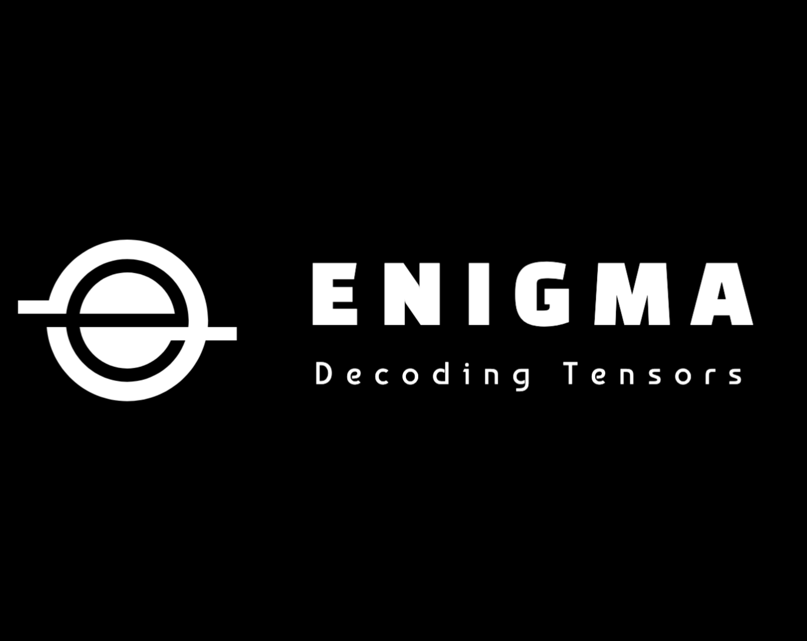

# Enigma

## Work In Progress... 🚧

Enigma is a C/C++ based tensor framework designed for building dynamic neural networks with optimized tensor computations and GPU acceleration, featuring seamless **Python** bindings for easy integration and usage through a simple `enigma` import.

<p align="center">
  
</p>

### Language Support:

 

## Installation

```bash
pip install enigma
```

<details>
<summary>Project Roadmap(Click Me)</summary>
  
## 0. **Core Foundation**

- [x] **0.1 Storage Implementation**

  - [x] Basic Storage class with memory management
  - [x] Custom Data-Pointer for memory ownership
  - [x] Exception-safe memory operations
  - [x] CPU Allocator with future CUDA support design

- [x] **0.2 Memory Optimization**

  - [x] Copy-on-Write (COW) mechanism
  - [x] Lazy cloning implementation
  - [x] Thread-safe reference counting
  - [x] Automatic materialization

- [x] **0.3 Device Abstraction**

  - [x] Device type enumeration
  - [x] Device-specific allocator framework
  - [x] CPU device implementation
  - [x] Future CUDA device support

- [x] **0.4 Scalar Types**

  - [x] Basic scalar type implementations (float, int, etc.)
  - [x] Type conversion system
  - [x] Strict-Handling Overflow/Underflow between casting
  - [x] All explicit-cast design
  - [ ] Integration with Storage system (maybe not needed since, stack-based implementation)
  - [x] Memory-aligned operations

- [x] **0.5 Scalar Operations**
  - [x] Basic arithmetic/logical operations
  - [x] Type promotion rules
  - [x] Operation error handling

## 1. **Core Tensor Library**

- [ ] **1.1 Tensor Representation**
  - [ ] Implement basic tensor data structures.
  - [ ] Support for different data types (float, int, double, etc.).
  - [ ] Memory management for tensors on CPU and GPU.
- [ ] **1.2 Tensor Operations**
  - [ ] Implement basic operations (addition, subtraction, multiplication, division).
  - [ ] Support broadcasting and indexing for element-wise operations.
  - [ ] Advanced operations like matrix multiplication and tensor contraction.
- [ ] **1.3 Memory Management**
  - [ ] Implement memory pooling to reduce allocation overhead.
  - [ ] Reference counting for efficient memory release.
- [ ] **1.4 Device Management**
  - [ ] Support for multiple devices (CPU and multiple GPUs).
  - [ ] Device-agnostic API for tensor operations.

## 2. **CUDA Integration**

- [ ] **2.1 CUDA Kernels**
  - [ ] Implement custom CUDA kernels for basic tensor operations.
  - [ ] Use shared memory and other optimizations for speedup.
- [ ] **2.2 GPU Memory Management**
  - [ ] Efficient allocation and deallocation of GPU memory.
  - [ ] Async data transfers between host and device.
- [ ] **2.3 Multi-GPU Support**
  - [ ] Implement data parallelism across multiple GPUs.
  - [ ] Enable collective communication operations (e.g., all-reduce).
- [ ] **2.4 Mixed Precision Training**
  - [ ] Implement support for FP16/FP32 mixed precision.
  - [ ] Integrate loss scaling to prevent underflow.

## 3. **Dynamic Neural Network Support**

- [ ] **3.1 Computation Graph**
  - [ ] Implement dynamic computation graph support for building models.
  - [ ] Track tensor dependencies for automatic differentiation.
- [ ] **3.2 Autograd Engine**
  - [ ] Create a backpropagation engine for gradient computation.
  - [ ] Support gradient accumulation and clearing.
- [ ] **3.3 Model Layers**
  - [ ] Implement basic layers (linear, convolution, recurrent).
  - [ ] Support custom layer definitions using core tensor operations.

## 4. **Optimizers and Training Utilities**

- [ ] **4.1 Optimizers**
  - [ ] Implement basic optimizers (SGD, Adam, RMSProp).
  - [ ] Support parameter updates for mixed precision training.
- [ ] **4.2 Training Loop Utilities**
  - [ ] Provide utilities for common training loop tasks (logging, checkpointing).
  - [ ] Implement gradient clipping and accumulation.

## 5. **DeepSpeed ZeRO Optimizations**

- [ ] **5.1 ZeRO-1: Data Parallelism Optimization**
  - [ ] Partition optimizer states across multiple devices.
  - [ ] Implement communication strategies for reduced memory usage.
- [ ] **5.2 ZeRO-2: Activation Partitioning**
  - [ ] Implement partitioning of activations during forward pass.
  - [ ] Recompute activations during backpropagation to save memory.
- [ ] **5.3 ZeRO-3: Full Model Partitioning**
  - [ ] Partition model weights, gradients, and optimizer states.
  - [ ] Implement communication scheduling to minimize overhead.

## 6. **Advanced Features**

- [ ] **6.1 Graph Optimizations**
  - [ ] Apply optimizations like graph pruning and kernel fusion.
  - [ ] Optimize computation graph for performance.
- [ ] **6.2 Quantization and Pruning**
  - [ ] Implement techniques for model compression (quantization-aware training).
  - [ ] Support pruning of model weights for efficient inference.
- [ ] **6.3 Custom Kernel Integration**
  - [ ] Allow users to integrate custom CUDA/OpenCL kernels.
  - [ ] Provide utilities for compiling and executing custom kernels.

## 7. **Testing and Benchmarking**

- [ ] **7.1 Unit Tests**
  - [ ] Develop unit tests for all core functionalities.
  - [ ] Ensure correct behavior of operations across different devices.
- [ ] **7.2 Performance Benchmarks**
  - [ ] Benchmark core tensor operations and neural network training.
  - [ ] Compare performance with existing frameworks like PyTorch, TensorFlow.
- [ ] **7.3 Memory and Computational Profiling**
  - [ ] Measure memory usage and computational efficiency.
  - [ ] Optimize memory footprint and speed for various use cases.

## 8. **Documentation and Community Involvement**

- [ ] **8.1 User Guide**
  - [ ] Provide comprehensive documentation for core functionalities.
  - [ ] Create tutorials for building and training models with Enigma.
- [ ] **8.2 Developer Guide**
  - [ ] Document internal design choices and code structure.
  - [ ] Include guidelines for contributing to the project.

---

</details>

## Quick Start

```python
import enigma

# Create scalars
x = enigma.Scalar(42)        # Integer
y = enigma.Scalar(3.14)      # Float
z = enigma.Scalar(1 + 2j)    # Complex
b = enigma.Scalar(True)      # Boolean

# Basic arithmetic
result = x + y               # Automatic type promotion
print(result)                # 45.14
```

## Basic Usage

### Creating Scalars

```python
import enigma

# Different ways to create scalars
i = enigma.Scalar(42)        # Integer type
f = enigma.Scalar(3.14)      # Float type
c = enigma.Scalar(1 + 2j)    # Complex type
b = enigma.Scalar(True)      # Boolean type

# Check types
print(i.dtype)               # ScalarType.Int64
print(f.is_floating_point()) # True
print(c.is_complex())        # True
print(b.is_bool())          # True
```

### Arithmetic Operations

```python
# Basic arithmetic with automatic type promotion
x = enigma.Scalar(10)
y = enigma.Scalar(3)

addition = x + y             # 13
subtraction = x - y         # 7
multiplication = x * y      # 30
division = x / y            # 3.333... (promotes to float)

# Mixed-type operations
f = enigma.Scalar(3.14)
result = x * f              # 31.4 (float result)
```

### Type Conversion

```python
# Safe type conversions
x = enigma.Scalar(42)
as_float = x.to_float()    # 42.0
as_int = x.to_int()        # 42
as_bool = x.to_bool()      # True

# Error handling for invalid conversions
try:
    enigma.Scalar(3.14).to_int()  # Will raise ScalarTypeError
except enigma.ScalarTypeError as e:
    print(f"Cannot convert: {e}")
```

### Type Promotion Rules

```python
# Check type promotion
int_type = enigma.int64
float_type = enigma.float64
result_type = enigma.promote_types(int_type, float_type)
print(result_type)  # ScalarType.Float64

# Automatic promotion in operations
i = enigma.Scalar(5)           # Int64
f = enigma.Scalar(2.5)         # Float64
result = i + f                 # Result is Float64
print(result.dtype)            # ScalarType.Float64
```

### Error Handling

```python
try:
    # Division by zero
    result = enigma.Scalar(1) / enigma.Scalar(0)
except enigma.ScalarError as e:
    print(f"Error: {e}")

try:
    # Invalid type conversion
    float_val = enigma.Scalar(3.14)
    int_val = float_val.to_int()  # Will raise ScalarTypeError
except enigma.ScalarTypeError as e:
    print(f"Conversion error: {e}")
```

### Complex Numbers

```python
# Working with complex numbers
c1 = enigma.Scalar(1 + 2j)
c2 = enigma.Scalar(2 - 1j)

# Complex arithmetic
sum_c = c1 + c2              # 3 + 1j
prod_c = c1 * c2             # 4 + 3j

# Converting to Python complex
py_complex = c1.to_complex() # Get Python complex number
print(py_complex.real)       # 1.0
print(py_complex.imag)       # 2.0
```

### Type Safety

```python
# Strict type checking
bool_val = enigma.Scalar(True)
int_val = enigma.Scalar(1)

# No implicit conversion between bool and int
print(bool_val == int_val)   # False

# Check if casting is possible
can_cast = enigma.can_cast(enigma.float64, enigma.int64)
print(can_cast)              # False (can't safely cast float to int)
```

### Comparisons

```python
# Value comparisons
a = enigma.Scalar(42)
b = enigma.Scalar(42.0)
c = enigma.Scalar(43)

print(a == b)    # True (same value, different types)
print(a != c)    # True
```

## Advanced Features

### Epsilon Comparisons for Floating Point

```python
x = enigma.Scalar(0.1 + 0.2)
y = enigma.Scalar(0.3)

# Automatically handles floating point precision
print(x == y)    # True
```
